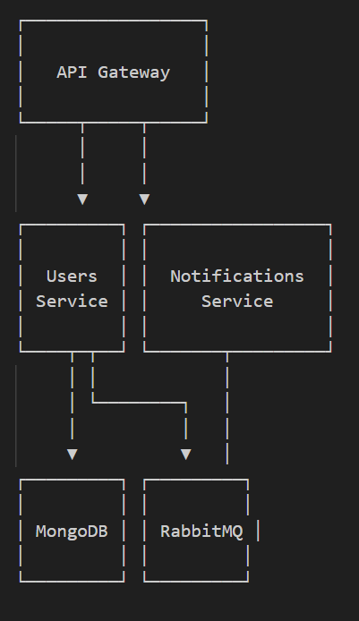

### Start
```bash
docker-compose up
```

#### Issues

In case of any issues, run this:

```bash
docker-compose down -v && docker-compose build --no-cache && docker-compose up
```

If you run `docker-compose down -v` folder `volumes` needs to be deleted manually like so `sudo rm -fR ./volumes`

### Architecture



### Endpoints

**Users**
- GET `/api/v1/users`
- POST `/api/v1/users`
- PATCH `/api/v1/users/:id`
- DELETE `/api/v1/users:id`
- GET `/api/v1/users/health`

**Notifications**
- GET `/api/v1/notifications/health`


